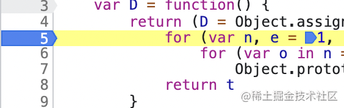
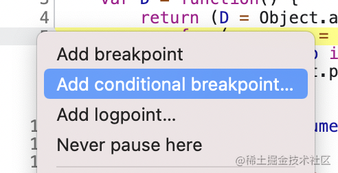
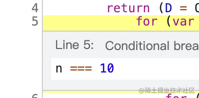
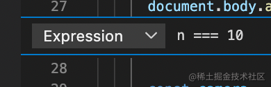
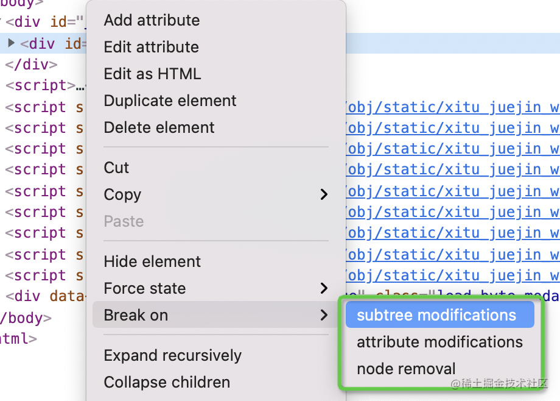
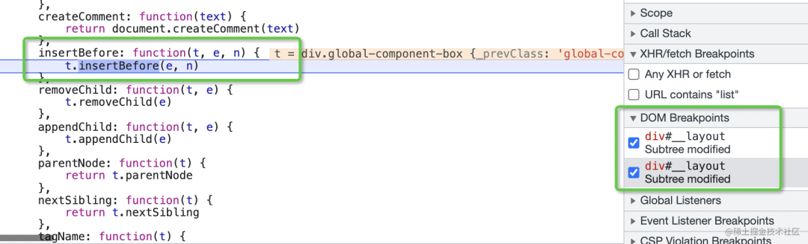
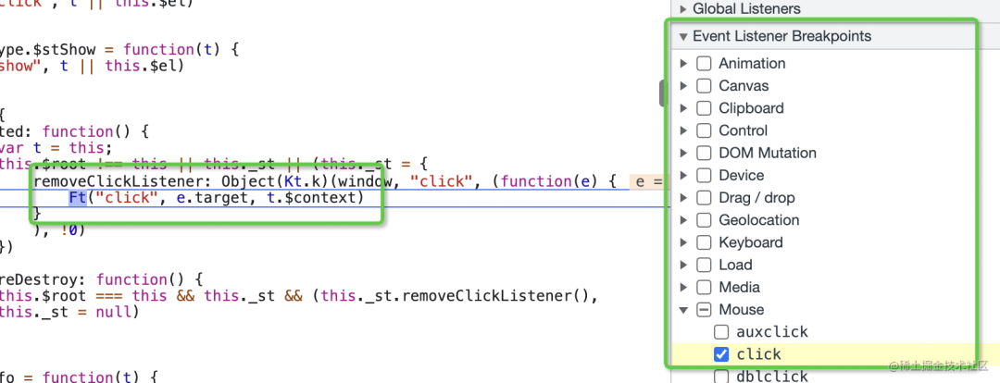
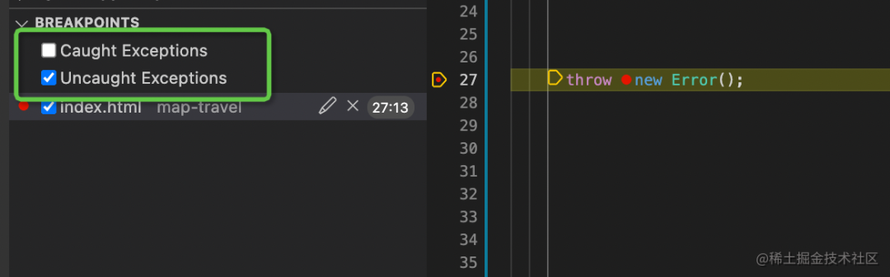

# JS 的 6 种打断点的方式

Debugger 是前端开发很重要的一个工具，它可以在我们关心的代码处断住，通过单步运行来理清逻辑。而 Debugger 用的好坏与断点打得好坏有直接的关系。

Chrome Devtools 和 VSCode 都提供了 Debugger，它们支持的打断点的方式有 6 种。

## 普通断点

在想断住的那一行左侧单击一下就可以添加一个断点，运行到该处就会断住。

这是最基础的断点方式，VSCode 和 Chrome Devtools 都支持这种断点。

## 条件断点

右键单击代码所在的行左侧，会出现一个下拉框，可以添加一个条件断点。

输入条件表达式，当运行到这一行代码并且表达式的值为真时就会断住，这比普通断点灵活些。

这种根据条件来断住的断点 VSCode 和 Chrome Devtools 也都支持。

## DOM 断点

在 Chrome Devtools 的 Elements 面板的对应元素上右键，选择 break on，可以添加一个 dom 断点，也就是当子树有变动、属性有变动、节点移除这三种情况的时候会断住。可以用来调试导致 dom 变化的代码。

因为是涉及到 DOM 的调试，只有 Chrome Devtools 支持这种断点。

## URL 断点

在 Chrome Devtools 的 Sources 面板可以添加 XHR 的 url 断点，当 ajax 请求对应 url 时就会断住，可以用来调试请求相关的代码。

这个功能只有 Chrome Devtools 有。

## Event Listener 断点

在 Chrome Devtools 的 Sources 面板还可以添加 Event Listener 的断点，指定当发生什么事件时断住，可以用来调试事件相关代码。

这个功能也是只有 Chrome Devtools 有。

## 异常断点

在 VSCode 的 Debugger 面板勾选 Uncaught Exceptions 和 Caught Exceptions 可以添加异常断点，在抛出异常未被捕获或者被捕获时断柱。用来调试一些发生异常的代码时很有用。

这个功能只有 VSCode 有。